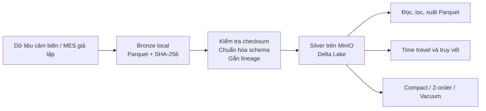

# Smart Dairy Factory — Lakehouse Storage

Hạ tầng lưu trữ dữ liệu cho dự án IT5425, sử dụng **MinIO + Delta Lake + Polars/PyArrow**. Luồng hiện có lưu dữ liệu thô vào Bronze trên máy local, sau đó kiểm tra checksum, chuẩn hóa kiểu dữ liệu và nạp vào Silver trên MinIO.

Repository hiện triển khai chủ yếu phân hệ lưu trữ. Crawler, Great Expectations, OpenLineage, tầng Gold/chDB, mô hình dự báo và dashboard được mô tả trong kế hoạch PDF nhưng chưa có mã triển khai trong folder này.

## 1. Kiến trúc và nơi lưu dữ liệu



| Thành phần | Vai trò |
|---|---|
| MinIO | Dịch vụ lưu trữ object tương thích S3, chạy trong Docker. |
| Parquet | Định dạng file dữ liệu dạng cột. |
| Delta Lake | Quản lý dữ liệu Parquet và nhật ký `_delta_log`, cung cấp giao dịch và phiên bản bảng. Dùng qua thư viện Python, không cần container Delta riêng. |
| Polars / PyArrow | Xử lý DataFrame, chuyển đổi schema và đọc/ghi dữ liệu. |
| Bronze | Dữ liệu đầu vào trên máy chạy Python, kèm checksum SHA-256. |
| Silver | Bảng Delta đã chuyển đổi kiểu dữ liệu, có thông tin truy vết nguồn gốc. |

Sau khi nạp dữ liệu, cấu trúc điển hình là:

```text
Máy chạy Python:
data/
└── 01_bronze_vault/
    ├── sensor_telemetry/
    │   └── YYYY-MM-DD/
    │       ├── sensor_telemetry_<thời điểm ghi>.parquet
    │       └── sensor_telemetry_<thời điểm ghi>.sha256
    └── mes_lims/
        └── YYYY-MM-DD/
            ├── mes_lims_<thời điểm ghi>.parquet
            └── mes_lims_<thời điểm ghi>.sha256

Bucket MinIO:
smart-dairy-lakehouse/
└── 02_silver_curated/
    ├── sensor_telemetry/
    │   ├── _delta_log/
    │   └── line_id=LINE_UHT_1/
    │       └── ingestion_date=YYYY-MM-DD/
    │           └── <file dữ liệu>.parquet
    └── mes_lims/
        ├── _delta_log/
        └── ...
```

MinIO lưu object trong Docker named volume `minio_data`, mount vào `/bitnami/minio/data` trong container. Tên volume thực tế có thể có tiền tố tên Compose project. Đây không phải thư mục `data/` của repository.

Đường dẫn local `data/02_silver_curated` dành cho bản xuất/snapshot; `data/03_gold_marts` mới được khai báo cấu hình. Các thư mục dữ liệu được tạo khi cần, không có sẵn chỉ nhờ clone repository.

## 2. Yêu cầu trước khi chạy

- Windows PowerShell, mở tại thư mục gốc `ProjectIT5425`.
- Docker Desktop đã cài, đang chạy và dùng Linux containers.
- Python **3.12** để phù hợp với giới hạn `numpy>=1.24.0,<2.0.0` trong `requirements.txt`.
- Kết nối mạng để cài thư viện và tải Docker image ở lần chạy đầu.
- Cổng `9000` và `9001` chưa bị dịch vụ khác sử dụng.

NumPy 1.26.4 hỗ trợ Python 3.9–3.12; không dùng Python 3.14 với bộ yêu cầu hiện tại. Tham khảo [ghi chú phát hành NumPy 1.26.4](https://numpy.org/doc/2.1/release/1.26.4-notes.html).

Kiểm tra công cụ:

```powershell
py -3.12 --version
docker version
docker compose version
```

Các lệnh bên dưới gọi trực tiếp Python trong `.venv`, không yêu cầu chạy `Activate.ps1` hay thay đổi execution policy.

## 3. Cài đặt và chạy hạ tầng

### Bước 1 — Cài thư viện Python

Mở PowerShell tại thư mục có `requirements.txt`, `infra/` và `src/`, rồi chạy:

```powershell
py -3.12 -m venv .venv
.\.venv\Scripts\python.exe -m pip install --upgrade pip
.\.venv\Scripts\python.exe -m pip install -r requirements.txt
```

Repository chưa có `pyproject.toml` hoặc `setup.py`; không dùng `pip install -e .`. Đặt `PYTHONPATH` ở bước tiếp theo để import package trong `src/`.

### Bước 2 — Đặt biến môi trường

Chạy trong cùng cửa sổ PowerShell:

```powershell
$env:PYTHONPATH = (Join-Path (Get-Location).Path 'src')
$env:PYTHONIOENCODING = 'utf-8'
$env:MINIO_ENDPOINT = 'localhost:9000'
$env:MINIO_ACCESS_KEY = 'dairy'
$env:MINIO_SECRET_KEY = 'hustit5425'
$env:MINIO_BUCKET = 'smart-dairy-lakehouse'
$env:MINIO_SECURE = 'false'
$env:FACTORY_TIMEZONE = 'UTC'
$env:BRONZE_LOCAL_PATH = (Join-Path (Get-Location).Path 'data\01_bronze_vault')
```

- Các giá trị MinIO trên khớp với Compose hiện có và dành cho demo local.
- `MINIO_ENDPOINT` không chứa tiền tố `http://`; code tự ghép giao thức.
- `BRONZE_LOCAL_PATH` là tên biến đúng trong mã nguồn. Dùng đường dẫn tuyệt đối giúp truy vết ổn định hơn khi thay đổi thư mục làm việc.
- Python hiện chỉ đọc `os.getenv`, **không tự nạp `.env`**.
- Biến môi trường có hiệu lực trong cửa sổ hiện tại. Mỗi lần mở terminal mới cần chạy lại bước này trước khi chạy Python.
- Compose đang ghi trực tiếp tài khoản và bucket. Nếu đổi cấu hình, cần cập nhật cả Compose và biến môi trường của Python cho tương ứng.

### Bước 3 — Bật MinIO

```powershell
docker compose -f infra/docker-compose.minio.yml up -d
docker compose -f infra/docker-compose.minio.yml ps
docker compose -f infra/docker-compose.minio.yml logs --tail 50 minio
```

Chờ MinIO khởi động xong, rồi mở giao diện quản trị:

| Thông tin | Giá trị mặc định |
|---|---|
| S3 API | `http://localhost:9000` |
| MinIO Console | [http://localhost:9001](http://localhost:9001) |
| Username | `dairy` |
| Password | `hustit5425` |
| Bucket | `smart-dairy-lakehouse` |

Compose sử dụng image `bitnamilegacy/minio:latest` và cấu hình tạo bucket khi khởi tạo. Lệnh `up -d` chỉ bật dịch vụ MinIO, chưa sinh dữ liệu nghiệp vụ hay chạy pipeline Python.

### Bước 4 — Kiểm tra kết nối và ghi/đọc

```powershell
.\.venv\Scripts\python.exe infra/check_minio.py
```

Script thực hiện:

1. Kết nối MinIO, liệt kê bucket và tạo bucket cấu hình nếu chưa có.
2. Ghi/đọc dữ liệu thử trên Delta Lake.
3. Sinh 60 dòng cảm biến, ghi qua Bronze và đọc lại từ MinIO.

Kết quả mong đợi là cả ba mục `connection`, `delta_write`, `sensor_generator` đều `PASS`. Script có ghi dữ liệu thử và hiện chưa đặt exit code lỗi theo kết quả kiểm tra; cần đọc phần `Results` trong output.

Hai bảng thử được ghi trực tiếp ở gốc bucket:

```text
s3://smart-dairy-lakehouse/test_sensor
s3://smart-dairy-lakehouse/sensor_telemetry
```

Chúng khác các bảng Silver chính dưới `02_silver_curated/` ở bước tiếp theo.

### Bước 5 — Nạp dữ liệu cảm biến vào Silver chính

```powershell
.\.venv\Scripts\python.exe -m lakehouse_storage.mock_sensor_stream --batches 3 --samples 60 --interval 1 --line-id LINE_UHT_1 --batch-id BATCH_DEMO_001 --seed 42
```

Lệnh trên sinh 3 batch × 60 dòng = **180 dòng**, ghi Bronze kèm checksum, rồi append vào:

```text
s3://smart-dairy-lakehouse/02_silver_curated/sensor_telemetry
```

Nếu bảng chưa có, lần ghi đầu tạo bảng ở version `0`; hai lần sau lần lượt tạo version `1` và `2`. Nếu bảng đã tồn tại, số dòng và version tiếp tục tăng từ trạng thái hiện có.

| Tham số | Ý nghĩa |
|---|---|
| `--batches` | Số batch cần sinh; `0` là chạy liên tục. |
| `--samples` | Số dòng mỗi batch; timestamp các mẫu cách nhau 1 giây. |
| `--interval` | Thời gian chờ giữa hai batch, tính bằng giây. Không phải khoảng cách timestamp của từng mẫu. |
| `--line-id` | Mã dây chuyền. |
| `--batch-id` | Mã lô dùng để truy vết; nếu bỏ qua, giá trị có thể null. |
| `--seed` | Seed để tái lập các giá trị ngẫu nhiên; thời điểm sinh mặc định vẫn thay đổi. |

Muốn mô phỏng liên tục:

```powershell
.\.venv\Scripts\python.exe -m lakehouse_storage.mock_sensor_stream --batches 0 --samples 60 --interval 60 --batch-id BATCH_STREAM_001
```

Dừng bộ sinh bằng `Ctrl+C`; MinIO vẫn chạy.

### Bước 6 — Sinh dữ liệu cảm biến và MES/LIMS theo ngày

```powershell
.\.venv\Scripts\python.exe -m lakehouse_storage.generate_mes_data --days 1 --date 2026-01-15 --seed 5425 --line-id LINE_UHT_1 --write-delta
```

Mỗi ngày sinh 4 lô, mỗi lô kéo dài 2 giờ, tổng cộng:

- **28.800 dòng cảm biến** được nạp vào `sensor_telemetry`.
- **4 dòng MES/LIMS** được nạp vào `mes_lims`.
- File Bronze và checksum cho cả hai nguồn.

`--days` điều chỉnh số ngày, `--date` là ngày bắt đầu, `--defect-rate` điều chỉnh xác suất lô lỗi (mặc định `0.05`). Hai bảng được ghi lần lượt; đây không phải một giao dịch chung cho cả hai bảng.

Nếu chỉ cần sinh file local, không cần MinIO, bỏ `--write-delta`:

```powershell
.\.venv\Scripts\python.exe -m lakehouse_storage.generate_mes_data --days 1 --date 2026-01-15 --output-dir data/synthetic
```

Kết quả:

```text
data/synthetic/
├── sensors_2026-01.parquet
├── mes_2026-01.parquet
└── batch_farm_map.json
```

Chế độ xuất local chưa ghi Bronze/Silver và có thể ghi đè file cùng tên khi chạy lại. Chế độ `--write-delta` không xuất các file synthetic hoặc `batch_farm_map.json` này.

## 4. Đọc dữ liệu, time travel và truy vết

Sau khi chạy bước 5, dán toàn bộ khối sau vào cùng PowerShell:

```powershell
@'
from lakehouse_storage import (
    get_silver_table_uri,
    read_silver_table,
    get_table_stats,
    get_table_history,
    load_version,
    trace_batch,
    export_silver_parquet,
)

uri = get_silver_table_uri("sensor_telemetry")

print("Thong ke:", get_table_stats(uri))
print(read_silver_table(uri, line_id="LINE_UHT_1", limit=5))
print("Lich su:", get_table_history(uri))

first = load_version(uri, version=0)
print("So dong o version 0:", first.height)

audit = trace_batch(uri, batch_id="BATCH_DEMO_001")
print("File Bronze:", audit["lineage"]["bronze_file"])
print("Checksum khop:", audit["integrity_verified"])

exported = export_silver_parquet(
    uri,
    "data/02_silver_curated/sensor_snapshot.parquet",
    line_id="LINE_UHT_1",
)
print("Snapshot:", exported)
'@ | .\.venv\Scripts\python.exe -
```

Kết quả mong đợi: đọc được dữ liệu và lịch sử, checksum khớp với file Bronze được truy vết, đồng thời tạo snapshot local. Version `0` có thể không còn đọc được nếu các file cần thiết đã bị vacuum trước đó.

Các cột truy vết chính là `_bronze_file`, `_bronze_sha256`, `_ingested_at` và `_source_system`. Giữ lại Bronze để kiểm tra nguồn gốc; chỉ sao chép dữ liệu MinIO sang máy khác chưa đủ để kiểm tra file Bronze local.

MinIO Console hiển thị bucket và object. Truy vấn bảng, lọc dòng và time travel thực hiện qua thư viện Python.

## 5. Kiểm thử và bảo trì

Chạy bộ kiểm thử:

```powershell
.\.venv\Scripts\python.exe -m pytest tests -q
```

Xem độ phủ:

```powershell
.\.venv\Scripts\python.exe -m pytest tests --cov=lakehouse_storage --cov-report=term-missing
```

Các test dùng dữ liệu mẫu và bảng Delta local trong thư mục tạm, không yêu cầu MinIO đang chạy. Để xác nhận kết nối S3 thực tế, vẫn cần chạy `infra/check_minio.py`.

Ví dụ gộp file nhỏ và xem trước các file có thể dọn:

```powershell
@'
from lakehouse_storage import (
    get_silver_table_uri,
    get_maintenance_stats,
    compact_table,
    vacuum_table,
)

uri = get_silver_table_uri("sensor_telemetry")
print("Truoc:", get_maintenance_stats(uri))
print("Compact:", compact_table(uri))
print("Vacuum preview:", vacuum_table(uri, retention_hours=168, dry_run=True))
print("Sau:", get_maintenance_stats(uri))
'@ | .\.venv\Scripts\python.exe -
```

Compaction có ghi thay đổi vào bảng. `dry_run=True` chỉ áp dụng cho vacuum, trả danh sách mà chưa xóa file. Vacuum thật có thể làm mất khả năng đọc version cũ phụ thuộc các file bị xóa. Chỉ đổi sang `dry_run=False` khi đã xác định thời gian cần giữ lịch sử.

## 6. Dừng và chạy lại

Dừng MinIO:

```powershell
docker compose -f infra/docker-compose.minio.yml stop
```

Chạy lại:

```powershell
docker compose -f infra/docker-compose.minio.yml up -d
```

Nếu muốn gỡ container và network nhưng giữ named volume:

```powershell
docker compose -f infra/docker-compose.minio.yml down
```

**Không thêm `-v` nếu muốn giữ dữ liệu MinIO.** `down -v` xóa named volume của Compose. Dữ liệu Bronze local được lưu riêng ngoài container.

Mỗi lần làm việc lại: mở Docker Desktop, mở PowerShell tại gốc dự án, đặt lại biến môi trường ở bước 2, bật MinIO rồi chạy lệnh Python cần thiết. Không cần tạo lại `.venv` hoặc cài lại thư viện nếu môi trường vẫn còn.

## 7. Danh mục file

### Thư mục gốc và hạ tầng

| File | Tác dụng |
|---|---|
| [README.md](README.md) | Hướng dẫn cài đặt, chạy và sử dụng hạ tầng. |
| [requirements.txt](requirements.txt) | Thư viện lưu trữ, xử lý và kiểm thử. Hiện chưa khóa chính xác toàn bộ phiên bản. |
| [.gitignore](.gitignore) | Bỏ qua môi trường ảo, cache, dữ liệu sinh ra và một số tài liệu khi quản lý bằng Git. |
| [Project5425 ke hoach.pdf](Project5425%20ke%20hoach.pdf) | Kế hoạch tổng thể 21 trang, gồm 7 phân hệ, phân công và tiến độ. |
| [Project5425_ke_hoach.pdf](Project5425_ke_hoach.pdf) | Bản sao cùng nội dung của PDF kế hoạch trên. |
| [infra/docker-compose.minio.yml](infra/docker-compose.minio.yml) | Khai báo service MinIO, cổng, bucket, tài khoản và volume. |
| [infra/check_minio.py](infra/check_minio.py) | Kiểm tra kết nối và ghi/đọc Delta thực tế trên MinIO. |

Thư mục ẩn `.git/` chứa lịch sử, nhánh, index, cấu hình và các object của Git; không phải dữ liệu nghiệp vụ hay thành phần cần chạy.

### Package `src/lakehouse_storage/`

| File | Tác dụng |
|---|---|
| [__init__.py](src/lakehouse_storage/__init__.py) | Xuất API chung của package và khai báo phiên bản. |
| [config.py](src/lakehouse_storage/config.py) | Đọc biến môi trường, cấu hình S3, đường dẫn, URI bảng và tham số bảo trì. |
| [schemas.py](src/lakehouse_storage/schemas.py) | Schema Bronze/Silver, registry 7 bảng, alias, partition và các hằng số nghiệp vụ. |
| [bronze_writer.py](src/lakehouse_storage/bronze_writer.py) | Ghi Parquet và checksum, kiểm tra cột bắt buộc, đọc/liệt kê file Bronze, kiểm tra đường dẫn khi cung cấp root. |
| [silver_manager.py](src/lakehouse_storage/silver_manager.py) | Nạp Bronze, chuyển kiểu, thêm lineage, ghi/đọc Delta, xuất snapshot, thống kê và xóa dòng theo điều kiện. |
| [time_travel.py](src/lakehouse_storage/time_travel.py) | Đọc version/thời điểm, lịch sử commit, so sánh ID thêm/xóa, truy vết batch/event và báo cáo audit. |
| [maintenance.py](src/lakehouse_storage/maintenance.py) | Compaction, Z-order, vacuum, thống kê dung lượng và đề xuất tối ưu. |
| [utils.py](src/lakehouse_storage/utils.py) | Tính SHA-256 theo từng khối file. |
| [mock_sensor_stream.py](src/lakehouse_storage/mock_sensor_stream.py) | Sinh cảm biến giả lập; CLI ghi từng batch qua Bronze vào Silver. |
| [generate_mes_data.py](src/lakehouse_storage/generate_mes_data.py) | Sinh MES/LIMS và cảm biến theo ngày; xuất file local hoặc ghi Bronze/Silver. |
| [README.md](src/lakehouse_storage/README.md) | Giới thiệu package và ví dụ API. Khi thiết lập môi trường, dùng các bước trong README gốc này. |
| [API_REFERENCE.md](src/lakehouse_storage/API_REFERENCE.md) | Tài liệu các hàm Python. Chưa có REST API server trong repository. |

### Bộ kiểm thử `tests/`

| File | Tác dụng |
|---|---|
| [conftest.py](tests/conftest.py) | Đường dẫn import và fixture dữ liệu/thư mục tạm dùng chung. |
| [test_schemas.py](tests/test_schemas.py) | Schema, registry, alias, kiểu dữ liệu và partition. |
| [test_bronze_writer.py](tests/test_bronze_writer.py) | Ghi/đọc Bronze, checksum và tổ chức file theo ngày. |
| [test_silver_manager.py](tests/test_silver_manager.py) | Append, đọc/lọc, lineage, version, xuất snapshot và xóa dòng. |
| [test_time_travel.py](tests/test_time_travel.py) | Version lịch sử, so sánh dữ liệu, audit và truy vết. |
| [test_maintenance.py](tests/test_maintenance.py) | Compaction, vacuum mô phỏng, thống kê và xử lý Z-order. |
| [test_mock_sensor_stream.py](tests/test_mock_sensor_stream.py) | Dữ liệu cảm biến giả lập và chuyển đổi Silver. |
| [test_generate_mes_data.py](tests/test_generate_mes_data.py) | MES, trạng thái lô lỗi, số dòng mỗi ngày và liên kết batch. |
| [test_integration.py](tests/test_integration.py) | Luồng Bronze → Delta local → time travel → audit. |
| [test_issue_fixes.py](tests/test_issue_fixes.py) | Kiểm thử hồi quy cho checksum, đường dẫn, ép kiểu, alias, metadata và mặc định bảo trì. |

## 8. Các bảng dữ liệu

| Bảng | Nội dung | Phân vùng Silver |
|---|---|---|
| `sensor_telemetry` (`S1`) | Cảm biến dây chuyền | `line_id`, `ingestion_date` |
| `mes_lims` (`S2`) | Lô sản xuất và kiểm nghiệm | `line_id`, `ingestion_date` |
| `market_prices` (`S3`) | Giá nguyên liệu | `ingestion_date` |
| `market_indices` | Chỉ số giá FAO | `ingestion_date` |
| `weather` (`S4`) | Thời tiết trang trại | `farm_id`, `ingestion_date` |
| `food_recalls` (`S5`) | Cảnh báo thu hồi thực phẩm | `ingestion_date` |
| `bronze_metadata` | Metadata thu thập dữ liệu | `fetched_at` |

Schema được đăng ký không có nghĩa bảng đã tồn tại trên MinIO. Hướng dẫn demo tạo `sensor_telemetry` và `mes_lims`; các nguồn khác cần cung cấp dữ liệu theo schema rồi nạp bằng API chung.

## 9. Xử lý lỗi thường gặp

| Hiện tượng | Cách kiểm tra / xử lý |
|---|---|
| Không tìm thấy `docker` | Cài Docker Desktop, mở lại terminal và kiểm tra `docker version`. |
| Docker không kết nối được daemon | Mở Docker Desktop, chờ engine sẵn sàng rồi chạy lại. |
| `py -3.12` không tìm thấy Python | Cài Python 3.12 và kiểm tra các bản cài bằng `py -0p`. |
| Cài NumPy thất bại trên Python 3.14 | Tạo môi trường bằng Python 3.12 theo hướng dẫn; không dùng Python mặc định 3.14. |
| Không tải được image MinIO | Kiểm tra lỗi pull, mạng và khả năng truy cập image `bitnamilegacy/minio:latest`; xem log Compose. Chưa thể chạy service nếu image chưa tải được. |
| `ModuleNotFoundError: lakehouse_storage` | Chạy từ gốc repository và đặt lại `$env:PYTHONPATH` theo bước 2. |
| Thiếu `polars`, `pyarrow` hoặc `deltalake` | Cài `requirements.txt` bằng đúng `.venv\Scripts\python.exe`. |
| `Connection refused` đến cổng 9000 | Kiểm tra `docker compose ... ps`, log MinIO và `MINIO_ENDPOINT`. |
| Cổng 9000/9001 đã được dùng | Dừng dịch vụ gây xung đột hoặc sửa port mapping; nếu đổi cổng S3 phía host thì đổi cả `MINIO_ENDPOINT`. |
| Sai access key hoặc chữ ký | Đối chiếu tài khoản trong Compose và biến môi trường Python. |
| Không tìm thấy bucket | Chạy `infra/check_minio.py` hoặc tạo bucket trong Console đúng tên `MINIO_BUCKET`. |
| Bảng Delta chưa tồn tại | Chạy bộ sinh dữ liệu hoặc nạp một file Bronze trước khi đọc bảng. |
| Không tìm thấy version `1` | Bảng mới có thể chỉ có version `0`; xem `get_table_history()` trước. |
| Checksum thất bại | Kiểm tra cặp `.parquet`/`.sha256` có bị sửa hoặc thiếu; khôi phục đúng dữ liệu nguồn trước khi nạp. |
| Truy vết trả `integrity_verified=False` | Kiểm tra file Bronze còn tồn tại ở đường dẫn được ghi trong bảng và nội dung còn khớp hash. |
| Cảnh báo `found in sys.modules ... prior to execution` khi chạy `python -m` | `__init__.py` import sẵn module generator nên có thể xuất hiện RuntimeWarning; kiểm tra phần output tiếp theo để xác định lệnh có hoàn tất hay không. |

## 10. Giới hạn cần biết

- Ghi Silver hiện dùng append, chưa tự chống nạp trùng. Chạy lại cùng ngày hoặc nạp lại cùng file có thể thêm bản ghi trùng.
- Bronze tránh ghi đè theo logic chương trình, chưa có cơ chế khóa bất biến ở cấp hệ điều hành/object storage.
- `ingest_multiple_files()` trong `bronze_writer.py` kiểm tra checksum và báo kết quả từng file; không tự nạp chúng vào Silver. Dùng `ingest_bronze_file()` để nạp.
- `trace_batch()` hiện lấy file Bronze từ dòng đầu tiên của batch để kiểm tra checksum; chưa xác minh tất cả file khi batch trải qua nhiều lần ghi.
- `diff_versions()` so sánh tập ID để tìm dòng thêm/xóa; không phải phép so sánh đầy đủ mọi thay đổi giá trị trên cùng ID.
- `compact_table()` nhận `target_file_size_mb` nhưng hiện chưa truyền tham số này xuống Delta engine; không bảo đảm file kết quả đúng 128 MB.
- Z-order loại bỏ cột đã dùng làm partition; nếu chỉ truyền `line_id` cho bảng sensor đã partition theo `line_id`, thao tác Z-order sẽ được bỏ qua.
- Checksum và lineage hỗ trợ truy vết dữ liệu; riêng các chức năng này chưa chứng minh hệ thống đáp ứng đầy đủ tiêu chuẩn ISO 22000.
- Compose mới chạy một service MinIO. Repository chưa cấu hình cụm phân tán, lịch chạy tự động hoặc dashboard.

Các lệnh được đối chiếu với mã nguồn hiện có. Khi biên soạn hướng dẫn, chưa chạy xác nhận toàn bộ trên MinIO và chưa chạy pytest do môi trường kiểm tra thiếu Docker trong PATH và các thư viện dự án. Sau khi cài đặt, dùng bước 4 và bộ test để xác nhận trên máy của bạn.
