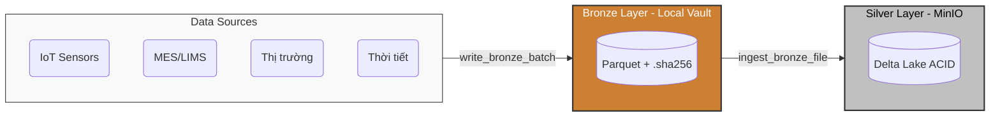

# 🥛 Lakehouse Storage Module

> **Smart Dairy Factory Lakehouse Core Engine**  
> Quản lý toàn bộ vòng đời lưu trữ dữ liệu nhà máy sữa UHT theo kiến trúc Medallion (Bronze ➔ Silver) trên nền **MinIO (S3)** và **Delta Lake**.

---

## 🏗️ Kiến trúc luồng dữ liệu (Data Flow)



---

## ⚡ Quick Start (Copy & Paste)

Dưới đây là kịch bản hoàn chỉnh (end-to-end) từ việc sinh dữ liệu giả lập, ghi vào Bronze, đưa lên Silver cho tới truy vấn dữ liệu và truy vết ISO 22000.

```python
import polars as pl
from lakehouse_storage import (
    generate_sensor_batch,
    write_bronze_batch,
    get_silver_table_uri,
    get_partition_columns,
    ingest_bronze_file,
    read_silver_table,
    load_version,
    trace_batch,
)

# -----------------------------------------------------------------------------
# Bước 1: Sinh dữ liệu mẫu & Ghi vào tầng Bronze (Raw Landing - Bất biến)
# -----------------------------------------------------------------------------
df_raw = generate_sensor_batch(
    n_samples=10, 
    line_id="LINE_UHT_1", 
    batch_id="BATCH_20260115_01"
)

# Tự động tạo thư mục theo ngày & ghi Parquet kèm SHA-256 sidecar
bronze_file_path = write_bronze_batch(df_raw, "sensor_telemetry")
print(f"✅ [Bronze] File đã lưu: {bronze_file_path}")

# -----------------------------------------------------------------------------
# Bước 2: Ingest từ Bronze lên Silver (Delta Lake trên MinIO - ACID)
# -----------------------------------------------------------------------------
table_name = "sensor_telemetry"
silver_uri = get_silver_table_uri(table_name)
partition_cols = get_partition_columns(table_name)

# Verify SHA-256, cast schema, append lineage & ghi ACID
ingest_result = ingest_bronze_file(
    bronze_path=bronze_file_path,
    silver_table_uri=silver_uri,
    partition_by=partition_cols,
    table_name=table_name
)
print(f"✅ [Silver] Đã nạp thành công: {ingest_result['rows_ingested']} dòng")

# -----------------------------------------------------------------------------
# Bước 3: Đọc và truy vấn bảng Silver
# -----------------------------------------------------------------------------
df_silver = read_silver_table(silver_uri, line_id="LINE_UHT_1", limit=5)
print("\n📊 Dữ liệu Silver:")
print(df_silver.select(["timestamp", "line_id", "uht_temp", "flow_rate"]))

# -----------------------------------------------------------------------------
# Bước 4: Time Travel & Truy vết nguồn gốc (ISO 22000 Traceability)
# -----------------------------------------------------------------------------
# Xem lại trạng thái lịch sử
df_v1 = load_version(silver_uri, version=1)

# Kiểm toán nguồn gốc của một lô (Batch)
audit = trace_batch(silver_uri, batch_id="BATCH_20260115_01")
print(f"\n🔍 ISO 22000 - File gốc: {audit['lineage']['bronze_file']}")
print(f"🔍 ISO 22000 - Toàn vẹn dữ liệu: {audit['integrity_verified']}")
```

---

## 🛠️ Tùy chọn cấu hình môi trường

Tất cả cấu hình được quản lý qua biến môi trường (hoặc file `.env` ở thư mục gốc).

> [!IMPORTANT]  
> Yêu cầu phải khởi động MinIO container trước khi thực hiện thao tác với tầng Silver:  
> `docker compose -f infra/docker-compose.minio.yml up -d`

```bash
# S3 Configuration
MINIO_ENDPOINT=localhost:9000
MINIO_ACCESS_KEY=dairy
MINIO_SECRET_KEY=hustit5425
MINIO_BUCKET=smart-dairy-lakehouse

# Local Bronze Directory
BRONZE_PATH=data/01_bronze_vault
```

---

## 📂 Danh mục bảng dữ liệu (Tables Registry)

| ID | Bảng (`table_name`) | Phân vùng vật lý (`partition_by`) | Nguồn / Ý nghĩa |
| :-- | :--- | :--- | :--- |
| **S1** | `sensor_telemetry` | `line_id`, `ingestion_date` | IoT Telemetry cảm biến nhiệt, áp suất |
| **S2** | `mes_lims` | `line_id`, `ingestion_date` | Nhật ký mẻ sản xuất & kiểm nghiệm vi sinh |
| **S3** | `market_prices` | `ingestion_date` | Giá nguyên liệu thế giới (GDT, CME, USDA) |
| **S3b**| `market_indices` | `ingestion_date` | Chỉ số giá sữa FAO (Dữ liệu vĩ mô) |
| **S4** | `weather` | `farm_id`, `ingestion_date` | Thời tiết trang trại & chỉ số THI stress |
| **S5** | `food_recalls` | `ingestion_date` | Cảnh báo thu hồi an toàn thực phẩm FDA/VFA |
| **Meta**| `bronze_metadata` | `fetched_at` | Metadata quy trình cào dữ liệu tự động |

---

## 🧩 Tổng quan Modules

- **`schemas`**: Chứa PyArrow Schemas trung tâm (Source of Truth).
- **`bronze_writer`**: Xử lý ghi dữ liệu raw xuống ổ cứng cục bộ an toàn, chống ghi đè.
- **`silver_manager`**: Quản lý thao tác đọc/ghi ACID với Delta Lake MinIO.
- **`time_travel`**: Cung cấp hàm tra cứu quá khứ & hỗ trợ kiểm toán chất lượng.
- **`maintenance`**: Công cụ dọn rác, chống phân mảnh (`compact`, `z-order`, `vacuum`).

> [!TIP]  
> Mọi hàm public, cấu trúc tham số, và các ngoại lệ (Exception) đều được tài liệu hóa chi tiết tại:  
> 👉 **[API_REFERENCE.md](file:///home/kh0ngm1nh/Documents/HUST/20261/Data%20management%20and%20visualization%20-%20IT5425/Project/ProjectIT5425_Nhom2/src/lakehouse_storage/API_REFERENCE.md)**
