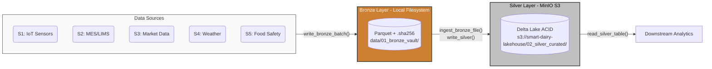

# Lakehouse Storage

> **Smart Dairy Factory - Core Storage Engine (v2.0.0)**
>
> Quản lý toàn bộ vòng đời lưu trữ dữ liệu nhà máy sữa UHT theo kiến trúc Medallion (Bronze -> Silver) trên **MinIO (S3-compatible)** và **Delta Lake**.

---

## Overview

`lakehouse_storage` là storage engine cho hệ thống Smart Dairy Factory. Package cung cấp:

- **Ghi dữ liệu Bronze**: Landing dữ liệu thô bất biến (Parquet + SHA-256 sidecar) trên local filesystem.
- **Ghi dữ liệu Silver**: ACID append vào Delta Lake trên MinIO S3, với schema enforcement và type casting tự động.
- **Đọc dữ liệu Silver**: Truy vấn Delta table với partition pruning, column selection, và filtering.
- **Time-travel & Traceability**: Truy vấn lịch sử phiên bản, truy vết lô hàng về file Bronze gốc, hỗ trợ kiểm toán ISO 22000.
- **Table maintenance**: Compaction, Z-order optimization, và vacuum cho Delta tables.
- **Schema registry**: Source of Truth cho PyArrow schemas (Bronze/Silver) của 7 bảng dữ liệu.
- **Data generators**: Tạo dữ liệu giả lập (IoT sensor, MES/LIMS) cho testing và demo.

---

## Role in the Data Pipeline

```text
Raw Data Sources (IoT, MES/LIMS, Web Crawling, API)
       |
       v
Data Ingestion & Preprocessing    <-- package khác (data_ingestion, mes_processor,
       |                               quality_control, ...)
       v
lakehouse_storage                  <-- package này
   - Ghi raw data vào Bronze (Parquet + SHA-256)
   - Transform Bronze -> Silver (type casting, lineage)
   - ACID append vào Delta Lake trên MinIO
   - Đọc / truy vấn Silver tables
   - Time-travel & truy vết ISO 22000
   - Bảo trì Delta tables
       |
       v
Downstream Analytics              <-- analytics, spc, modeling packages
   (Star Schema, OLAP, SPC, ...)
```

Package này nhận dữ liệu đã được thu thập và chuẩn bị bởi upstream components (`data_ingestion`, `mes_processor`, `quality_control`), sau đó chịu trách nhiệm lưu trữ, quản lý phiên bản, và cung cấp dữ liệu cho downstream analytics.

---

## Responsibilities

**Package chịu trách nhiệm:**

- Ghi raw data vào Bronze layer (Parquet + SHA-256 checksum)
- Verify integrity qua SHA-256 sidecar
- Transform và ghi dữ liệu vào Silver Delta Lake (ACID)
- Schema enforcement (Bronze/Silver schemas)
- Type casting (float64 -> float32, string -> timestamp)
- Thêm lineage columns (`_bronze_file`, `_bronze_sha256`, `_ingested_at`, `ingestion_date`)
- Đọc và truy vấn Delta tables
- Time-travel (load version, load as-of timestamp)
- Truy vết nguồn gốc lô hàng (ISO 22000 traceability)
- Bảo trì Delta tables (compact, Z-order, vacuum)
- Export Silver data ra Parquet tĩnh
- Cung cấp data generators cho testing

**Package KHÔNG chịu trách nhiệm:**

- Thu thập / crawl dữ liệu từ nguồn (web scraping, API calls)
- Preprocessing dữ liệu (cleaning, deduplication, outlier detection)
- Data quality validation (Great Expectations rules)
- OLAP / Star Schema / aggregation (Gold layer analytics)
- Statistical Process Control (SPC)
- Visualization (dashboards, charts)

---

## Architecture / Data Flow



---

## Installation

```bash
# Cài đặt dependencies
pip install -r requirements.txt

# Khởi động MinIO (bắt buộc cho Silver layer)
docker compose -f infra/docker-compose.minio.yml up -d
```

> [!IMPORTANT]
> MinIO container phải chạy trước khi thực hiện bất kỳ thao tác nào với Silver layer (Delta Lake trên S3).

---

## Quick Start

```python
from lakehouse_storage import (
    generate_sensor_batch,
    write_bronze_batch,
    get_silver_table_uri,
    get_partition_columns,
    ingest_bronze_file,
    read_silver_table,
    trace_batch,
)

# 1. Tạo dữ liệu mẫu
df_raw = generate_sensor_batch(
    n_samples=10,
    line_id="LINE_UHT_1",
    batch_id="BATCH_20260115_01",
)

# 2. Ghi vào Bronze (Parquet + SHA-256 sidecar)
bronze_path = write_bronze_batch(df_raw, "sensor_telemetry")

# 3. Ingest Bronze -> Silver (verify checksum, transform, ACID append)
table_name = "sensor_telemetry"
silver_uri = get_silver_table_uri(table_name)
partition_cols = get_partition_columns(table_name)

result = ingest_bronze_file(
    bronze_path=bronze_path,
    silver_table_uri=silver_uri,
    partition_by=partition_cols,
    table_name=table_name,
)
print(f"Ingested {result['rows_ingested']} rows")

# 4. Đọc Silver table
df = read_silver_table(silver_uri, line_id="LINE_UHT_1", limit=5)
print(df)

# 5. Truy vết nguồn gốc (ISO 22000)
audit = trace_batch(silver_uri, batch_id="BATCH_20260115_01")
print(f"Bronze file: {audit['lineage']['bronze_file']}")
print(f"Integrity OK: {audit['integrity_verified']}")
```

---

## Writing Data

### Bronze Layer (Raw Landing)

```python
from lakehouse_storage import write_bronze_batch

# Ghi DataFrame thô vào Bronze (immutable, append-only)
path = write_bronze_batch(df, "sensor_telemetry")
# -> data/01_bronze_vault/sensor_telemetry/2026-01-15/sensor_telemetry_20260115_...parquet
# -> data/01_bronze_vault/sensor_telemetry/2026-01-15/sensor_telemetry_20260115_...sha256
```

### Silver Layer (Option A: từ Bronze file)

```python
from lakehouse_storage import ingest_bronze_file, get_silver_table_uri, get_partition_columns

# Đọc Bronze -> verify checksum -> transform -> ghi Silver
ingest_bronze_file(
    bronze_path=path,
    silver_table_uri=get_silver_table_uri("sensor_telemetry"),
    partition_by=get_partition_columns("sensor_telemetry"),
    table_name="sensor_telemetry",
)
```

### Silver Layer (Option B: từ DataFrame đã preprocessed)

```python
from lakehouse_storage import write_silver

# Ghi DataFrame đã được chuẩn bị bởi upstream component
version = write_silver(
    df=preprocessed_df,
    table_name="sensor_telemetry",
    source_bronze=original_bronze_path,  # Lineage reference
)
```

---

## Reading Data

```python
from lakehouse_storage import read_silver_table, get_silver_table_uri

uri = get_silver_table_uri("sensor_telemetry")

# Đọc toàn bộ
df = read_silver_table(uri)

# Đọc có filter
df = read_silver_table(
    uri,
    line_id="LINE_UHT_1",
    date_from="2026-01-01",
    date_to="2026-01-31",
    columns=["timestamp", "uht_temp", "flow_rate"],
    limit=1000,
)

# Export Silver ra Parquet tĩnh
from lakehouse_storage import export_silver_parquet
export_silver_parquet(uri, "output/sensor_export.parquet", date_from="2026-01-01")
```

---

## Configuration

Cấu hình qua environment variables:

```bash
# MinIO / S3
MINIO_ENDPOINT=localhost:9000      # MinIO endpoint
MINIO_ACCESS_KEY=dairy             # Access key
MINIO_SECRET_KEY=hustit5425        # Secret key
MINIO_SECURE=false                 # Sử dụng HTTPS
MINIO_BUCKET=smart-dairy-lakehouse # S3 bucket name

# Local paths
BRONZE_LOCAL_PATH=data/01_bronze_vault          # Bronze vault directory
SILVER_LOCAL_SNAPSHOT_PATH=data/02_silver_curated  # Silver export directory
GOLD_LOCAL_PATH=data/03_gold_marts              # Gold marts directory

# Timezone
FACTORY_TIMEZONE=UTC               # Timezone cho timestamp conversion
```

---

## Tables Registry

| ID | Table name | Partition columns | Mô tả |
|:---|:-----------|:------------------|:-------|
| S1 | `sensor_telemetry` | `line_id`, `ingestion_date` | IoT sensor: nhiệt độ, áp suất, lưu lượng |
| S2 | `mes_lims` | `line_id`, `ingestion_date` | MES/LIMS: lô sản xuất và kiểm nghiệm |
| S3 | `market_prices` | `ingestion_date` | Giá hàng hóa quốc tế (GDT/CME/USDA) |
| S3b | `market_indices` | `ingestion_date` | Chỉ số giá sữa FAO |
| S4 | `weather` | `farm_id`, `ingestion_date` | Thời tiết trang trại |
| S5 | `food_recalls` | `ingestion_date` | Thu hồi an toàn thực phẩm (FDA/VFA) |
| Meta | `bronze_metadata` | `fetched_at` | Metadata Bronze layer |

Có thể sử dụng alias `S1`-`S5` thay cho tên bảng trong hầu hết các API:

```python
from lakehouse_storage import get_silver_schema
schema = get_silver_schema("S1")  # tương đương get_silver_schema("sensor_telemetry")
```

---

## Package Structure

```
lakehouse_storage/
├── __init__.py          # Public API exports
├── config.py            # Environment variables, STORAGE_OPTIONS, table URIs
├── schemas.py           # PyArrow schemas (Source of Truth), registry, domain constants
├── bronze_writer.py     # Ghi raw Parquet + SHA-256 sidecar vào local filesystem
├── silver_manager.py    # Delta Lake ACID writes, reads, exports trên MinIO S3
├── time_travel.py       # Time-travel queries, truy vết, audit reports (ISO 22000)
├── maintenance.py       # Compaction, Z-order, vacuum cho Delta tables
├── mock_sensor_stream.py  # Generator dữ liệu IoT sensor
├── generate_mes_data.py   # Generator dữ liệu MES/LIMS
└── utils.py             # SHA-256 file hashing utility
```

---

## API Reference

Tài liệu chi tiết cho toàn bộ public API (function signatures, parameters, return values, error behavior):

**[API_REFERENCE.md](./API_REFERENCE.md)**

---

## Limitations / Notes

- **Bronze layer** chỉ hỗ trợ local filesystem (không ghi trực tiếp lên S3).
- **Silver layer** yêu cầu MinIO (hoặc S3-compatible) đang chạy.
- Schema enforcement chỉ áp dụng khi `table_name` được cung cấp. Nếu `table_name=None`, dữ liệu được ghi nguyên trạng.
- `vacuum_table` mặc định ở chế độ `dry_run=True` - phải truyền `dry_run=False` để thực sự xóa file.
- Data generators (`generate_sensor_batch`, `generate_mes_batch`, ...) tạo dữ liệu theo Bronze schema (string timestamps, float64). Conversion sang Silver schema được thực hiện tự động khi ghi qua `ingest_bronze_file` hoặc `append_to_delta`.
- Package sử dụng `polars` (không phải `pandas`) cho tất cả DataFrame operations.
